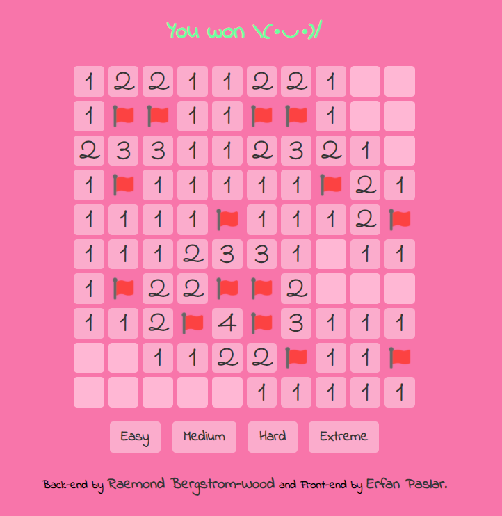

# Minesweeper-Python

And I ([ContigoMocs](https://github.com/ContigoMocs)) made a UI for it using my own library.

<figure class="post-figure">

</figure>

Use `pip install eel` to install the library.

For GUI run `minesweeperGUI.py`
And for TUI run `minesweeper.py`
